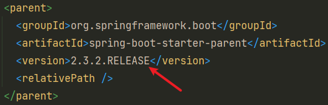
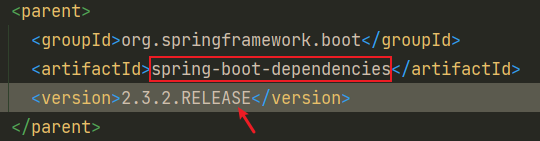
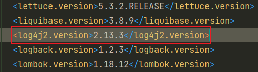
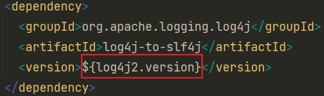
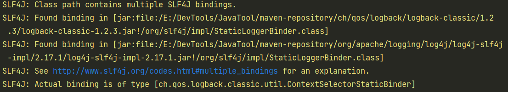

## SpringBoot集成log4j2

### 添加依赖

```xml
<!--log4j2-->
<dependency>
	<groupId>org.springframework.boot</groupId>
	<artifactId>spring-boot-starter-log4j2</artifactId>
</dependency>
```

### 一行配置搞定 Spring Boot项目的 log4j2 核弹漏洞

> https://www.cnblogs.com/didispace/p/15701878.html

只需在pom文件加上以下代码即可

```xml
<properties>
    <log4j2.version>2.17.1</log4j2.version>
</properties>
```

**原理：** 当我们在自己的Spring Boot中配置对应的properties，就可以覆盖parent中的properties，并实现版本的更新。










**其他方案**

```xml
<dependency>
    <groupId>org.springframework.boot</groupId>
    <artifactId>spring-boot-starter-log4j2</artifactId>
    <exclusions>
        <exclusion>
            <groupId>org.apache.logging.log4j</groupId>
            <artifactId>log4j-core</artifactId>
        </exclusion>
        <exclusion>
            <groupId>org.apache.logging.log4j</groupId>
            <artifactId>log4j-api</artifactId>
        </exclusion>
        <exclusion>
            <groupId>org.apache.logging.log4j</groupId>
            <artifactId>log4j-slf4j-impl</artifactId>
        </exclusion>
    </exclusions>
</dependency>
<!-- 2.17.1修复漏洞版本 -->
<dependency>
    <groupId>org.apache.logging.log4j</groupId>
    <artifactId>log4j-api</artifactId>
    <version>2.17.1</version>
</dependency>
<dependency>
    <groupId>org.apache.logging.log4j</groupId>
    <artifactId>log4j-core</artifactId>
    <version>2.17.1</version>
</dependency>
<dependency>
    <groupId>org.apache.logging.log4j</groupId>
    <artifactId>log4j-slf4j-impl</artifactId>
    <version>2.17.1</version>
</dependency>
```

### 启动告警问题



**告警分析：** 有多个SLF4J绑定，logback-classic-1.2.3.jar和log4j-slf4j-impl-2.17.1.jar里面重复绑定SLF4J。

**解决方案**

```xml
    <!-- spring-boot-starter -->
    <dependency>
      <groupId>org.springframework.boot</groupId>
      <artifactId>spring-boot-starter</artifactId>
      <exclusions>
        <exclusion>
          <groupId>org.springframework.boot</groupId>
          <artifactId>spring-boot-starter-logging</artifactId>
        </exclusion>
      </exclusions>
    </dependency>
```

