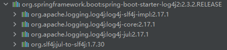

## SpringBoot集成log4j2及配置讲解

### 添加依赖

```xml
<!--log4j2-->
<dependency>
	<groupId>org.springframework.boot</groupId>
	<artifactId>spring-boot-starter-log4j2</artifactId>
</dependency>
```

### 一行配置搞定 Spring Boot项目的 log4j2 核弹漏洞

> https://www.cnblogs.com/didispace/p/15701878.html

只需在pom文件加上以下代码即可

```xml
<properties>
    <log4j2.version>2.17.1</log4j2.version>
</properties>
```

**原理：** 当我们在自己的Spring Boot中配置对应的properties，就可以覆盖parent中的properties，并实现版本的更新。




**其他方案**

```xml
<dependency>
    <groupId>org.springframework.boot</groupId>
    <artifactId>spring-boot-starter-log4j2</artifactId>
    <exclusions>
        <exclusion>
            <groupId>org.apache.logging.log4j</groupId>
            <artifactId>log4j-core</artifactId>
        </exclusion>
        <exclusion>
            <groupId>org.apache.logging.log4j</groupId>
            <artifactId>log4j-api</artifactId>
        </exclusion>
        <exclusion>
            <groupId>org.apache.logging.log4j</groupId>
            <artifactId>log4j-slf4j-impl</artifactId>
        </exclusion>
    </exclusions>
</dependency>
<!-- 2.17.1修复漏洞版本 -->
<dependency>
    <groupId>org.apache.logging.log4j</groupId>
    <artifactId>log4j-api</artifactId>
    <version>2.17.1</version>
</dependency>
<dependency>
    <groupId>org.apache.logging.log4j</groupId>
    <artifactId>log4j-core</artifactId>
    <version>2.17.1</version>
</dependency>
<dependency>
    <groupId>org.apache.logging.log4j</groupId>
    <artifactId>log4j-slf4j-impl</artifactId>
    <version>2.17.1</version>
</dependency>
```

### 启动告警问题


**告警分析：** 有多个SLF4J绑定，logback-classic-1.2.3.jar和log4j-slf4j-impl-2.17.1.jar里面重复绑定SLF4J。

**解决方案**

```xml
    <!-- spring-boot-starter -->
    <dependency>
      <groupId>org.springframework.boot</groupId>
      <artifactId>spring-boot-starter</artifactId>
      <exclusions>
        <exclusion>
          <groupId>org.springframework.boot</groupId>
          <artifactId>spring-boot-starter-logging</artifactId>
        </exclusion>
      </exclusions>
    </dependency>
```

### 配置

> https://www.cnblogs.com/wuqinglong/p/9516529.html

#### info、warn、error、debug不同级别输出到不同的文件里

```xml
<?xml version="1.0" encoding="UTF-8"?>
<configuration status="info" monitorInterval="60">
  <!-- status：log4j2自身内部的信息输出 monitorInterval：每隔60秒重新读取配置文件，可以不重启应用的情况下修改配置 -->
  <Properties>
    <property name="dir">logs</property>
    <property name="DEBUG_NAME">debug</property>
    <property name="INFO_NAME">info</property>
    <property name="WARN_NAME">warn</property>
    <property name="ERROR_NAME">error</property>
    <property name="DEBUG_NAME">debug</property>
    <property name="charset">UTF-8</property>
    <property name="pattern">[%d{yyyy-MM-dd HH:mm:ss.SSS}{GMT+8}] [%-5level] [%thread] [%logger{36}:%line] - %msg%n%ex
    </property>
  </Properties>
  <!-- 输出源 -->
  <Appenders>
    <!-- info -->
    <!-- 注意：这里的filePattern是测试，线上要根据实际情况修改%d{yyyy-MM-dd HH_mm_ss}-%i -->
    <!-- filePattern：文件后缀名声明为.gz或者.zip，就具有自动压缩日志功能 -->
    <RollingRandomAccessFile name="InfoFile" immediateFlush="true" bufferSize="2048" fileName="${dir}/${INFO_NAME}.log"
      filePattern="${dir}/${date:yyyy-MM}/${INFO_NAME}-%d{yyyy-MM-dd HH_mm_ss}-%i.log">
      <PatternLayout pattern="${pattern}" />
      <!--过滤器，决定日志事件能否被输出-->
      <!--
        onMatch和onMismatch都有三个属性值，分别为Accept、DENY和NEUTRAL
		（在log4j2中, 共有8个级别,按照从低到高为:ALL < TRACE < DEBUG < INFO < WARN < ERROR < FATAL < OFF。）
        onMatch="ACCEPT" 表示匹配该级别及以上
        onMatch="DENY" 表示不匹配该级别及以上
        onMatch="NEUTRAL" 表示该级别及以上的，由下一个filter处理，如果当前是最后一个，则表示匹配该级别及以上
        onMismatch="ACCEPT" 表示匹配该级别以下
        onMismatch="NEUTRAL" 表示该级别及以下的，由下一个filter处理，如果当前是最后一个，则不匹配该级别以下的
        onMismatch="DENY" 表示不匹配该级别以下的
      -->
      <Filters>
        <ThresholdFilter level="WARN" onMatch="DENY" onMismatch="NEUTRAL" />
        <ThresholdFilter level="INFO" onMatch="ACCEPT" onMismatch="DENY" />
      </Filters>
      <!--触发滚动策略-->
      <Policies>
        <!-- 基于Cron表达式的触发滚动策略 -->
        <!--<CronTriggeringPolicy schedule="0/5 * * * * ?" />-->
        <!--
          基于时间的触发滚动策略。该策略主要是完成周期性的log文件封存工作。
          这个配置需要和filePattern结合使用，filePattern日期格式精确到哪一位，interval也精确到哪一个单位。
          注意filePattern中配置的文件重命名规则是%d{yyyy-MM-dd HH-mm-ss}-%i，最小的时间粒度是ss，即秒钟。
          interval：默认是1，结合起来就是每1秒钟生成一个新文件。如果改成%d{yyyy-MM-dd HH}，最小粒度为小时，则每一个小时生成一个文件。
          modulate：属性是指从启动时间开始算5秒，还是从0秒开始算5秒。
          modulate: true(默认值) // 会从启动时间开始算5秒
          modulate: false // 从0秒开始算
          说明是否对封存时间进行调制。若modulate=true， 则封存时间将以0点为边界进行偏移计算。比如，modulate=true，interval=4hours，
          那么假设上次封存日志的时间为03:00，则下次封存日志的时间为04:00，之后的封存时间依次为08:00，12:00，16:00。
		  如果SizeBasedTriggeringPolicy设置size="10MB"，则一个interval单位内，日志超过10m，则也会触发滚动策略滚动。
        -->
        <TimeBasedTriggeringPolicy interval="1" modulate="true" />
        <!--基于日志文件大小的触发滚动策略。单位有：KB，MB，GB-->
        <SizeBasedTriggeringPolicy size="10 MB" />
      </Policies>
      <!--默认滚动策略：保存日志文件的最大个数，大于此值会删除旧的日志文件-->
      <DefaultRolloverStrategy max="30" />
    </RollingRandomAccessFile>
    <!-- warn -->
    <RollingRandomAccessFile name="WarnFile" immediateFlush="true" bufferSize="2048" fileName="${dir}/${WARN_NAME}.log"
      filePattern="${dir}/${date:yyyy-MM}/${WARN_NAME}-%d{yyyy-MM-dd}-%i.log">
      <PatternLayout pattern="${pattern}" />
      <Filters>
        <ThresholdFilter level="ERROR" onMatch="DENY" onMismatch="NEUTRAL" />
        <ThresholdFilter level="WARN" onMatch="ACCEPT" onMismatch="DENY" />
      </Filters>
      <Policies>
        <TimeBasedTriggeringPolicy interval="1" />
        <SizeBasedTriggeringPolicy size="10 MB" />
      </Policies>
      <DefaultRolloverStrategy max="30" />
    </RollingRandomAccessFile>
    <!-- error -->
    <RollingRandomAccessFile name="ErrorFile" immediateFlush="true" bufferSize="2048"
      fileName="${dir}/${ERROR_NAME}.log" filePattern="${dir}/${date:yyyy-MM}/${ERROR_NAME}-%d{yyyy-MM-dd}-%i.log">
      <PatternLayout pattern="${pattern}" />
      <Filters>
        <ThresholdFilter level="FATAL" onMatch="DENY" onMismatch="NEUTRAL" />
        <ThresholdFilter level="ERROR" onMatch="ACCEPT" onMismatch="DENY" />
      </Filters>
      <Policies>
        <TimeBasedTriggeringPolicy interval="1" />
        <SizeBasedTriggeringPolicy size="10 MB" />
      </Policies>
      <DefaultRolloverStrategy max="30" />
    </RollingRandomAccessFile>
    <!-- debug -->
    <RollingRandomAccessFile name="DebugFile" immediateFlush="true" bufferSize="2048"
      fileName="${dir}/${DEBUG_NAME}.log" filePattern="${dir}/${date:yyyy-MM}/${DEBUG_NAME}-%d{yyyy-MM-dd}-%i.log">
      <PatternLayout pattern="${pattern}" />
      <Filters>
        <ThresholdFilter level="INFO" onMatch="DENY" onMismatch="NEUTRAL" />
        <ThresholdFilter level="DEBUG" onMatch="ACCEPT" onMismatch="DENY" />
      </Filters>
      <Policies>
        <TimeBasedTriggeringPolicy interval="1" />
        <SizeBasedTriggeringPolicy size="10 MB" />
      </Policies>
      <DefaultRolloverStrategy max="30" />
    </RollingRandomAccessFile>
  </Appenders>

  <Loggers>
    <Root level="info">
      <AppenderRef ref="ErrorFile" />
      <AppenderRef ref="WarnFile" />
      <AppenderRef ref="InfoFile" />
    </Root>
  </Loggers>
</configuration>
```

#### 日志重复打印问题

如果Root中的日志包含了Logger中的日志信息，并且AppenderRef是一样的配置，则日志会打印两次。

**注意：**

1. 有两个条件Root中的日志包含了Logger中的日志信息。
2. 且AppenderRef是一样的配置。

这时候我们需要使用一个Logger的属性来解决，那就是additivity，其默认值为true，需要配置为false。

```xml
  <Loggers>
    <Root level="info">
      <AppenderRef ref="InfoFile" />
    </Root>
    <Logger name="org.xzhi.AppTest" level="info" additivity="false">
      <AppenderRef ref="run" />
    </Logger>
  </Loggers>
```

#### 通用配置

```xml
<?xml version="1.0" encoding="UTF-8"?>
<configuration status="info" monitorInterval="60">
  <!-- status：log4j2自身内部的信息输出 monitorInterval：每隔60秒重新读取配置文件，可以不重启应用的情况下修改配置 -->
  <Properties>
    <property name="dir">logs</property>
    <property name="charset">UTF-8</property>
    <property name="pattern">[%d{yyyy-MM-dd HH:mm:ss.SSS}{GMT+8}] [%-5level] [%thread] [%logger{36}:%line] - %msg%n%ex
    </property>
  </Properties>
  <Appenders>
    <!-- 全局日志 -->
    <RollingRandomAccessFile name="run" immediateFlush="true" bufferSize="2048" fileName="${dir}/run.log"
      filePattern="${dir}/${date:yyyy-MM}/run-%d{yyyy-MM-dd}-%i.log.zip">
      <PatternLayout pattern="${pattern}" />
      <Filters>
        <!--只输出DEBUG、INFO、WARN、ERROR四个级别的日志-->
        <ThresholdFilter level="FATAL" onMatch="DENY" onMismatch="NEUTRAL" />
        <ThresholdFilter level="DEBUG" onMatch="ACCEPT" onMismatch="DENY" />
      </Filters>
      <Policies>
        <TimeBasedTriggeringPolicy interval="1" />
        <SizeBasedTriggeringPolicy size="64 MB" />
      </Policies>
      <!--默认滚动策略：保存日志文件的最大个数，大于此值会删除旧的日志文件-->
      <DefaultRolloverStrategy max="30" />
    </RollingRandomAccessFile>
    <!-- 全局异常日志 -->
    <RollingRandomAccessFile name="exception" immediateFlush="true" bufferSize="2048" fileName="${dir}/exception.log"
      filePattern="${dir}/${date:yyyy-MM}/exception-%d{yyyy-MM-dd}-%i.log.zip">
      <PatternLayout pattern="${pattern}" />
      <Filters>
        <!--只输出ERROR级别的日志-->
        <ThresholdFilter level="FATAL" onMatch="DENY" onMismatch="NEUTRAL" />
        <ThresholdFilter level="ERROR" onMatch="ACCEPT" onMismatch="DENY" />
      </Filters>
      <Policies>
        <TimeBasedTriggeringPolicy interval="1" />
        <SizeBasedTriggeringPolicy size="64 MB" />
      </Policies>
      <DefaultRolloverStrategy max="30" />
    </RollingRandomAccessFile>
    <!-- 控制台打印 -->
    <Console name="console" target="SYSTEM_OUT">
      <PatternLayout pattern="${pattern}" />
      <Filters>
        <!--控制台只打印DEBUG、INFO、WARN、ERROR四个级别的日志-->
        <ThresholdFilter level="FATAL" onMatch="DENY" onMismatch="NEUTRAL" />
        <ThresholdFilter level="DEBUG" onMatch="ACCEPT" onMismatch="DENY" />
      </Filters>
    </Console>
  </Appenders>

  <Loggers>
    <Root level="info">
      <AppenderRef ref="run" />
      <AppenderRef ref="exception" />
      <!--线上建议关闭控制台输出-->
      <!--<AppenderRef ref="console"/>-->
    </Root>
  </Loggers>
</configuration>
```
#### 关闭指定包的日志输出

```xml
  <Loggers>
    <!--关闭指定包的日志输出-->
    <Logger name="io.seata.config.nacos" level="OFF" />
  </Loggers>
```

